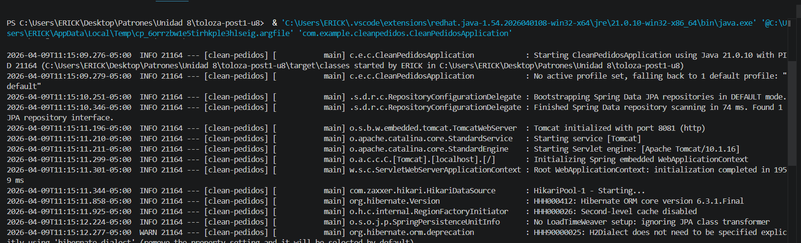

# Clean Pedidos - Clean Architecture

## Descripción
Sistema de gestión de pedidos implementado siguiendo los principios de **Clean Architecture** con sus cuatro círculos concéntricos: Entities, Use Cases, Interface Adapters y Frameworks & Drivers.

## Requisitos
- **Java**: JDK 17 o superior
- **Spring Boot**: 3.2.0
- **Maven**: 3.8+
- **Base de datos**: H2 (embedded)

## Instalación y Ejecución

### 1. Compilar el proyecto
```bash
mvn clean install
```

### 2. Ejecutar la aplicación
```bash
java -jar target/clean-pedidos-1.0.0.jar
```

O con Maven:
```bash
mvn spring-boot:run
```

La aplicación iniciará en `http://localhost:8081`

## Endpoints

### 1. Crear un pedido
```bash
POST http://localhost:8081/api/pedidos
Content-Type: application/json

{
  "clienteNombre": "Juan Perez",
  "lineas": [
    {
      "productoNombre": "Laptop",
      "cantidad": 1,
      "precioUnitario": 1500.00
    }
  ]
}
```

**Respuesta (201 Created):**
```json
{
  "pedidoId": "27c916b1-033c-42bb-b769-292cc016f40d"
}
```

### 2. Obtener un pedido por ID
```bash
GET http://localhost:8081/api/pedidos/27c916b1-033c-42bb-b769-292cc016f40d
```

**Respuesta (200 OK):**
```json
{
  "id": "27c916b1-033c-42bb-b769-292cc016f40d",
  "clienteNombre": "Juan Perez",
  "estado": "CONFIRMADO",
  "lineas": [
    {
      "productoNombre": "Laptop",
      "cantidad": 1,
      "precioUnitario": 1500.00
    }
  ],
  "total": 1500.00
}
```

### 3. Listar todos los pedidos
```bash
GET http://localhost:8081/api/pedidos
```

**Respuesta (200 OK):**
```json
[
  {
    "id": "27c916b1-033c-42bb-b769-292cc016f40d",
    "clienteNombre": "Juan Perez",
    "estado": "CONFIRMADO",
    "lineas": [
      {
        "productoNombre": "Laptop",
        "cantidad": 1,
        "precioUnitario": 1500.00
      }
    ],
    "total": 1500.00
  }
]
```

### Test 1: Crear Pedido
```
POST http://localhost:8081/api/pedidos
Body: {"clienteNombre":"Juan Perez","lineas":[{"productoNombre":"Laptop","cantidad":1,"precioUnitario":1500.00}]}

Response: 201 Created
{"pedidoId":"27c916b1-033c-42bb-b769-292cc016f40d"}
```

### Test 2: Recuperar Pedido
```
GET http://localhost:8081/api/pedidos/27c916b1-033c-42bb-b769-292cc016f40d

Response: 200 OK
{
  "id": "27c916b1-033c-42bb-b769-292cc016f40d",
  "clienteNombre": "Juan Perez",
  "estado": "CONFIRMADO",
  "lineas": [{"productoNombre": "Laptop", "cantidad": 1, "precioUnitario": 1500.00}],
  "total": 1500.00
}
```

### Test 3: Listar Todos
```
GET http://localhost:8081/api/pedidos

Response: 200 OK
[{...pedido anterior...}]
```

### 4. Logs de Consola (Arquitectura Limpia)
Evidencia de la traza de ejecución de Spring Boot. Demuestra que el flujo de dependencias respeta los límites arquitectónicos (de afuera hacia adentro, sin saltarse las capas del dominio) y confirma la correcta ejecución de los adaptadores de persistencia (JPA/Hibernate) al guardar el `Aggregate Root`.

